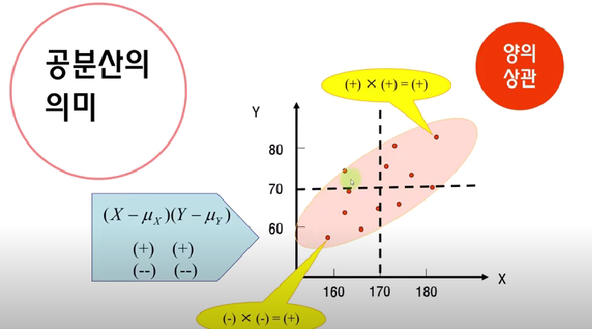
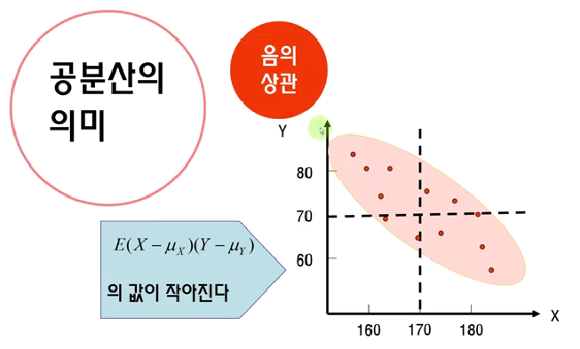
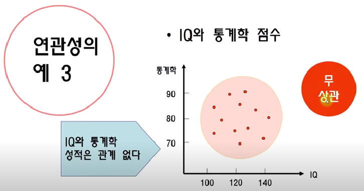
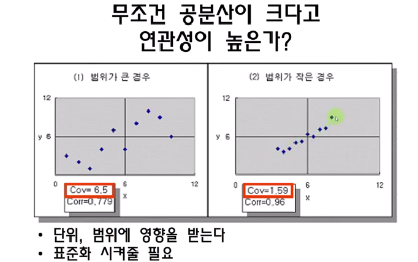

Daily Report 2021-12-12
===

## 통계
### 상관분석

#### 연관성
연관성이 있다는 말은 두 변수 간에 관련이 있다는 것을 말한다. 반대로 관련이 없다는 건 두 변수가 서로 독립이하는 얘기이다. 이러한 관계성을 판단하기 위해 우리는 연관성을 다루는 측도인 공분산을 먼저 공부하고,
상관계수에 대해서도 다뤄보자.

Ex 1. 키와 몸무게 - 양의 상관
두 변수가 같은 방향으로 움직일 때 우리는 이를 "양의 상관"이라고 한다.
양의 상관은 한 변수가 커지면 다른 하나도 커진다.

Ex 2. 흡연량과 기대수명 - 음의 상관
두 변수가 반대 방향으로 움직일 때 우리는 이를 "음의 상관"이라고 한다. 
음의 상관은 한 변수가 커지면 다른 한 변수는 작아진다.

Ex 3. IQ와 통계학 점수 - 무상관
패턴이 업다는 것은 곧 관계성이 없다는 것이고, 이것을 두 변수가 서로 "무상관"하다고 표현한다.

#### 공분산
공분산은 양의 상관이면 크고, 음의 상관이면 작고, 무상관이면 0에 가깝다.

Q. 무조건 공분산이 크다고 연관성이 높은가?
A. 공분산 값은 단위, 범위에 영향을 받는다. 어떤 것의 관계성이 더 큰지를 판단하려면 
   서로 다른 자료들을 표준화시켜줘야 한다.
   이때 표준화 시켜준, 궁극적인 연관성의 측도를 상관계수(correlation coefficient 相關係數)라고 한다.

상관계수는 모상관계수와 표본상관계수로 나뉜다.
모르는 모평균을 알기 위해 표본집단의 표본평균을 구하듯
모상관계수를 알기 위해서 표본집단의 표본상관계수인 피어슨 상관계수를 구한다.

1. 모상관계수

2. 표본상관계수
